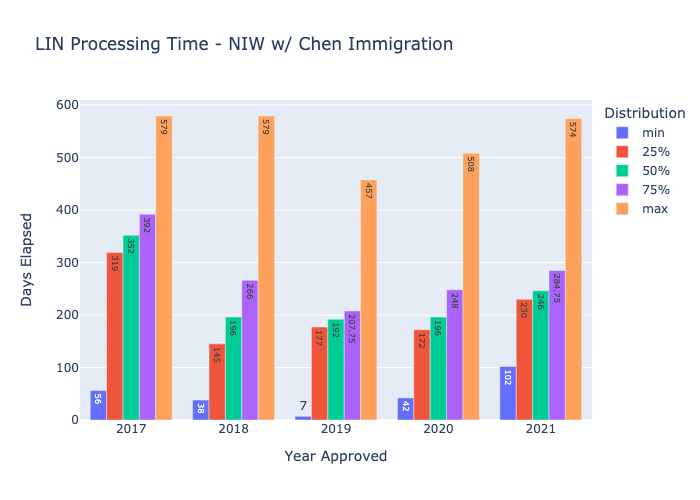

# EB2-NIW Wait Time Analysis Based on We Greened Data

This code scrapes data from the I-140 approvals section of the [Chen Immigration website](https://www.wegreened.com/eb1_niw_approvals) and processes it to determine current wait times by service center.

#### Note:
This codebase will download ~20K PNG files onto your disk, please ensure that you have enough space to avoid runtime issues.

### Analysis Steps:

1. Read form data present in `data/dataset.csv`
2. Check files on the Chen Immigration website and identify new forms that need to be scraped by filtering out those in the dataset. Also, filter out the PNG files already in the `output` directory
3. Get PDF stream from the Chen Immigration website
4. Transform PDF stream into PNG and download images necessary for parsing by [pytesseract](https://pypi.org/project/pytesseract/)
5. Parse images using [pytesseract](https://pypi.org/project/pytesseract/) and generate `I140Form` objects
6. Generate dataset based on `I140Form` features such as `notice date`, `receipt date`, `priority date`, and `NIW flag` indicating whether a form is for an NIW application
7. Generate yearly wait time distribution and plot for 2017+
8. Send plot as attachment to desired recipients via [SendGridAPI](https://sendgrid.com/)

### Installation and Running Instructions:
After cloning this repo, navigate to the location of your local copy in your terminal and run the following commands:
1. `python setup.py install`
2. `export SENDGRID_API_KEY=<YOUR_API_KEY>` to run the email client _[Optional]_

#### To scrape the data run:
3. `python -m src scrape --chunk-size=<CHUNK_SIZE>` where `<CHUNK_SIZE>` determines the number of forms to save to disk at a time.
#### To generate the wait time distribution run:
4. `python -m src distribution --service-center <SERVICE_CENTER>` where `<SERVICE_CENTER>` is either `SRC` for the Texas Service Center or `LIN` for the Nebraska Service Center
#### Add the `-e` flag to send an email with the distribution plot as an attachment
5. `python -m src distribution --service-center <SERVICE_CENTER> -e`

### Example Distribution Plot

